<!--
  GHANSHYAM MRUNAL JETTY — Profile README (v2, "Slate")
  Design notes: single accent (#58A6FF), monochrome badges, thin rules,
  generous whitespace. Restraint is the point — resist adding badges.
-->

 

**Seven years reading the numbers. Two years learning to build them.**

 

&nbsp;

&nbsp;

  

NEWCASTLE UPON TYNE, UK&nbsp;&nbsp;·&nbsp;&nbsp;OPEN TO UK · IRELAND · NETHERLANDS · USA · AUSTRALIA

  

 

---

 

## About

<table>
<tr>
<td width="60%" valign="top">

For seven years I worked the business side — digital marketing, vendor negotiations, real estate and facilities analysis, including time at **Amazon** and **Oracle**. Different titles, one pattern underneath: every role came down to numbers.

I managed vendor relationships at Amazon, ran paid campaigns across Google and Meta, and made facilities decisions at Oracle backed by cost data. I was reading the numbers. I wasn't the one building the models behind them.

That's what sent me back to university. I'm finishing an **MSc in Data Science (Advanced Practices)** at **Northumbria University**, adding machine learning and generative AI alongside it.

What I bring that most career-switchers don't is business context. I've sat on the other side of the table asking *what does this number actually mean for us* — so I know what a stakeholder needs from a dashboard before they know how to ask for it.

Looking for my next role as a **Data Analyst**, **Business Analyst** or **entry-level Data Scientist**.

</td>
<td width="40%" valign="top">

 

**EXPERIENCE**
 Amazon — vendor management
 Oracle — facilities analysis
 Digital marketing — 7 years

 

**EDUCATION**
 MSc Data Science (Advanced Practices)
 Northumbria University, UK

 

**IN PROGRESS**
 AWS ML Engineer — Associate

 

**FOCUS**
 Machine learning · Predictive analytics
 NLP & generative AI · Business intelligence

</td>
</tr>
</table>

 

---

 

## Toolkit

 

  

   

<table>
<tr>
<td align="right" width="30%"><b>ANALYSIS</b></td>
<td width="70%">Pandas&nbsp; · &nbsp;NumPy&nbsp; · &nbsp;SciPy&nbsp; · &nbsp;Statsmodels&nbsp; · &nbsp;Jupyter&nbsp; · &nbsp;Excel</td>
</tr>
<tr>
<td align="right"><b>MODELLING</b></td>
<td>scikit-learn&nbsp; · &nbsp;XGBoost&nbsp; · &nbsp;LightGBM&nbsp; · &nbsp;TensorFlow&nbsp; · &nbsp;PyTorch</td>
</tr>
<tr>
<td align="right"><b>LANGUAGE & AI</b></td>
<td>Hugging&nbsp;Face&nbsp; · &nbsp;Transformers&nbsp; · &nbsp;Text&nbsp;preprocessing&nbsp; · &nbsp;Fairness&nbsp;auditing</td>
</tr>
<tr>
<td align="right"><b>VISUALISATION</b></td>
<td>Power&nbsp;BI&nbsp; · &nbsp;Tableau&nbsp; · &nbsp;Matplotlib&nbsp; · &nbsp;Seaborn&nbsp; · &nbsp;Plotly</td>
</tr>
<tr>
<td align="right"><b>PLATFORM</b></td>
<td>AWS&nbsp; · &nbsp;SageMaker&nbsp; · &nbsp;Docker&nbsp; · &nbsp;MLflow&nbsp; · &nbsp;Streamlit&nbsp; · &nbsp;PySpark</td>
</tr>
</table>

 

<table>
<tr>
<td align="right" width="30%"><b>ANALYSIS</b></td>
<td width="70%">Pandas&nbsp; · &nbsp;NumPy&nbsp; · &nbsp;SciPy&nbsp; · &nbsp;Statsmodels&nbsp; · &nbsp;Excel</td>
</tr>
<tr>
<td align="right"><b>MODELLING</b></td>
<td>scikit-learn&nbsp; · &nbsp;XGBoost&nbsp; · &nbsp;TensorFlow&nbsp; · &nbsp;PyTorch</td>
</tr>
<tr>
<td align="right"><b>LANGUAGE & AI</b></td>
<td>Hugging&nbsp;Face&nbsp; · &nbsp;Transformers&nbsp; · &nbsp;LangChain&nbsp; · &nbsp;spaCy&nbsp; · &nbsp;RAG</td>
</tr>
<tr>
<td align="right"><b>VISUALISATION</b></td>
<td>Power&nbsp;BI&nbsp; · &nbsp;Tableau&nbsp; · &nbsp;Matplotlib&nbsp; · &nbsp;Seaborn&nbsp; · &nbsp;Plotly</td>
</tr>
<tr>
<td align="right"><b>PLATFORM</b></td>
<td>AWS&nbsp; · &nbsp;SageMaker&nbsp; · &nbsp;Docker&nbsp; · &nbsp;MLflow&nbsp; · &nbsp;PySpark</td>
</tr>
</table>

 

 

---

 

## Selected Work

<table>
<tr>
<td width="50%" valign="top">

 

### CARDIAC

HYBRID CONTROLLER-AUGMENTED ROUTING FOR DRUG-INDUCED ADVERSARIAL CARDIOTOXICITY

A modelling pipeline that routes molecular inputs through a controller layer to flag drug candidates carrying adversarial cardiotoxicity risk, pairing prediction with a safety-first evaluation loop.

`Python` &nbsp;`PyTorch` &nbsp;`Deep Learning`

  

</td>
<td width="50%" valign="top">

 

### Dialect

FROM RAW DATA TO RESPONSIBLE AI

An end-to-end NLP project tracing the route from messy raw text through cleaning, modelling and evaluation — with fairness checks built into the pipeline rather than bolted on afterwards.

`NLP` &nbsp;`Transformers` &nbsp;`Bias Auditing`

  

</td>
</tr>
<tr>
<td width="50%" valign="top">

### Breast Cancer Detection

DETECTING BREAST CANCER THROUGH DATA AND DEEP LEARNING

A classification pipeline on diagnostic features, tuned for recall rather than raw accuracy — in screening, a missed positive costs far more than a false alarm.

`TensorFlow` &nbsp;`Classification` &nbsp;`Medical Data`

  

</td>
<td width="50%" valign="top">

### Data Science Lab

NOTEBOOKS, EXPERIMENTS, APPLIED PRACTICE

A working collection covering statistical analysis, feature engineering, model comparison and visualisation — the bench behind the larger projects.

`Pandas` &nbsp;`EDA` &nbsp;`Feature Engineering`

  

</td>
</tr>
</table>

 

---

 

## Activity

 

&nbsp;&nbsp;

  

 

 

---

 

## Currently

<table>
<tr>
<td width="25%" valign="top"><b>AWS ML ENGINEER</b> Associate track — SageMaker, pipelines, deployment</td>
<td width="25%" valign="top"><b>AGENTIC AI & RAG</b> LangChain, vector stores, retrieval evaluation</td>
<td width="25%" valign="top"><b>MLOPS</b> MLflow tracking, CI/CD for models, containers</td>
<td width="25%" valign="top"><b>ANALYTICS ENGINEERING</b> dbt, warehouse modelling, advanced SQL</td>
</tr>
</table>

 

---

 

 

### Get in touch

Open to Data Analyst, Business Analyst and entry-level Data Scientist roles.
 
Happy to talk models, dashboards, or the messy realities of real data.

 

 

   

There's a difference between reading a report and building what generates it.

  

